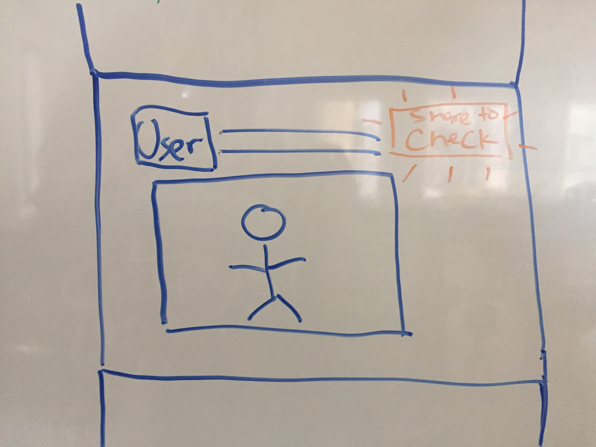

#Check-Mark#

Browser extension that allows users to use Check without navigating to the Check webapp itself. 

---

To use the extension, users should:

1. Click on a Facebook/Twitter post they want to import into a Check project
2. Open the extension (the post should automatically load into the extension popup)
3. From the popup, users can import the post into one of their verification projects
4. (Maybe) users can also update the status of verification, annotate, add notes, etc

The interface should look similar to the current Meedan Bridge web extension (will confer on this)

The extension will also include "Share to Check" buttons on social media posts (need to confer on how exactly injection interface will look like)

---

## Usage

First, you need to change into the subdirectory and install all
[NodeJS][nodejs] dependencies with [npm](http://npmjs.com/) or
[yarn](https://yarnpkg.com/):

    npm install

Start the continuous build process to transpile the code into something that
can run in Firefox or Chrome:

    npm run build

This creates a WebExtension in the `extension` subdirectory.
Any time you edit a file, it will be rebuilt automatically.

Files in the 'src' directory will be compiled into the 'extension/dist' folder.
